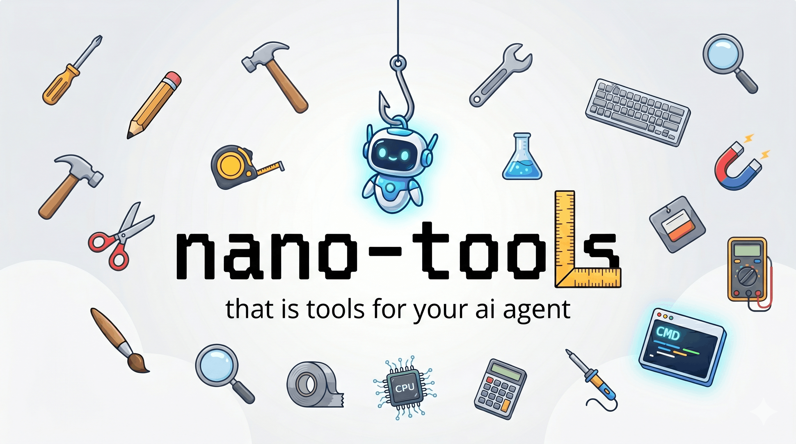

<div align="center">



<br/>

**LLM tool framework for AI agents — `@tool` decorator, 12 built-in tools, Anthropic + OpenAI loop. Built for nano-eco.**

[](https://python.org)
[](LICENSE)
[]()
[]()
[]()

</div>

---

## The Problem

AI agents that can only chat are useless in production. They need to read files, run code, search the web, call APIs. Existing frameworks (LangChain tools, pydantic-ai) ship 100+ dependencies, require complex setup, and tie tool definitions to a specific framework. On Windows, half of them break.

**nano-tools fixes all of it.**

---

## What Makes It Different

| Problem with others | nano-tools solution |
|---|---|
| Complex tool definition — classes, schemas, decorators from 3 files | **One `@tool` decorator** — wrap any Python function, schema auto-generated |
| Framework lock-in — tools only work with LangChain or only with pydantic-ai | **Provider-agnostic** — Anthropic + OpenAI format, works with any SDK |
| No tool-call loop — you manage the back-and-forth yourself | **Built-in loop** — `kit.run_loop()` handles multi-step tool calls automatically |
| No built-in tools — build everything from scratch | **12 ready-to-use tools** — files, code execution, web, calculator, datetime |
| No integration with LLM proxy / routing | **nano-proxy integration** — route all calls through nano-proxy, 1 line change |
| Windows support broken | **Windows-first** — tested on PowerShell, no POSIX assumptions |

---

## Quick Start

```bash
# Install
pip install git+https://github.com/ghanibot/nano-tools.git

# With web search + HTTP tools
pip install "git+https://github.com/ghanibot/nano-tools.git#egg=nano-tools[search]"

# Install everything
pip install "git+https://github.com/ghanibot/nano-tools.git#egg=nano-tools[all]"

# List all built-in tools
nano-tools list

# Run a tool directly
nano-tools run calculator '{"expression": "sqrt(144) * 7"}'

# Ask LLM with tools
nano-tools ask "Read README.md and summarize it" --tools file
```

---

## `@tool` Decorator

Convert any Python function into an LLM-callable tool. Schema is auto-generated from type hints and docstring.

```python
from nano_tools import tool, ToolKit

@tool
def get_stock_price(ticker: str) -> str:
    """Get the current stock price for a ticker symbol.
    ticker: Stock ticker e.g. AAPL, TSLA, MSFT
    """
    # your implementation
    return f"{ticker}: $182.50"

@tool
def send_email(to: str, subject: str, body: str) -> str:
    """Send an email to a recipient.
    to: Recipient email address
    subject: Email subject line
    body: Email body text
    """
    # your implementation
    return f"Email sent to {to}"

# Build kit and run with LLM
kit = ToolKit([get_stock_price, send_email])
result = kit.run_loop(
    "Check the price of AAPL and email it to ceo@company.com",
    model="claude-haiku-4-5-20251001",
)
print(result)
```

The decorator auto-generates this schema (no manual JSON needed):

```json
{
  "name": "get_stock_price",
  "description": "Get the current stock price for a ticker symbol.",
  "input_schema": {
    "type": "object",
    "properties": {
      "ticker": { "type": "string", "description": "Stock ticker e.g. AAPL, TSLA, MSFT" }
    },
    "required": ["ticker"]
  }
}
```

---

## ToolKit — Tool-Call Loop

`ToolKit` handles the full multi-step tool-call conversation automatically.

```python
from nano_tools import ToolKit
from nano_tools.builtin import FILE_TOOLS, WEB_TOOLS

kit = ToolKit(FILE_TOOLS + WEB_TOOLS)

# Anthropic (Claude)
result = kit.run_loop(
    prompt="Search for Python best practices and save a summary to notes.md",
    model="claude-haiku-4-5-20251001",
    max_iterations=10,
)

# OpenAI / Groq / Mistral / any OpenAI-compatible provider
result = kit.run_loop_openai(
    prompt="Search for Python best practices and save a summary to notes.md",
    model="gpt-4o-mini",
    base_url="https://api.groq.com/openai/v1",  # or any OpenAI-compatible URL
)

print(result)
```

---

## Built-in Tools

### File Tools
```python
from nano_tools.builtin import FILE_TOOLS
# read_file, write_file, list_files, append_file
```

| Tool | What it does |
|---|---|
| `read_file(path)` | Read file contents, truncates at 16k chars |
| `write_file(path, content)` | Write file, creates parent dirs automatically |
| `list_files(directory)` | List files + sizes in a directory |
| `append_file(path, content)` | Append to existing file |

### Code Tools
```python
from nano_tools.builtin import CODE_TOOLS
# run_python, run_shell
```

| Tool | What it does |
|---|---|
| `run_python(code)` | Execute Python in subprocess, 30s timeout |
| `run_shell(command)` | Run shell command, 30s timeout |

### Web Tools
```python
from nano_tools.builtin import WEB_TOOLS
# http_get, web_search
```

| Tool | What it does |
|---|---|
| `http_get(url)` | Fetch URL, return first 8k chars |
| `web_search(query)` | DuckDuckGo search, return top 5 results |

### Utility Tools
```python
from nano_tools.builtin import UTIL_TOOLS
# calculator, parse_json, current_datetime, http_post
```

| Tool | What it does |
|---|---|
| `calculator(expression)` | Safe math eval — `sqrt`, `sin`, `pow`, etc. |
| `parse_json(text)` | Parse + pretty-print JSON |
| `current_datetime()` | Return current date and time |
| `http_post(url, body)` | POST request with JSON body |

### Tool Groups
```python
from nano_tools.builtin import ALL_TOOLS, SAFE_TOOLS, FILE_TOOLS, CODE_TOOLS, WEB_TOOLS, UTIL_TOOLS

# SAFE_TOOLS = read_file, list_files, calculator, parse_json, current_datetime, http_get
# Use SAFE_TOOLS when you don't want the agent writing files or running code
```

---

## Door 1 — Direct Python (Standalone)

Use nano-tools without any other nano-eco components.

```python
from nano_tools import tool, ToolKit
from nano_tools.builtin import SAFE_TOOLS

@tool
def lookup_user(user_id: str) -> str:
    """Look up user information by ID.
    user_id: User identifier
    """
    return f"User {user_id}: name=Alice, role=admin"

kit = ToolKit(SAFE_TOOLS + [lookup_user])

result = kit.run_loop(
    "What are the details for user ID U-1042?",
    model="claude-haiku-4-5-20251001",
)
print(result)
```

---

## Door 2 — Via nano-proxy (nano-eco Integrated)

Route all LLM calls through nano-proxy for routing, fallback, cost tracking, and caching.

```python
import os
from nano_tools.integrations import toolkit_with_proxy

kit = toolkit_with_proxy(
    tools=FILE_TOOLS + WEB_TOOLS,
    proxy_url=os.environ.get("NANO_PROXY_URL", "http://localhost:8765"),
)

# All LLM calls go through nano-proxy:
# → fallback if rate-limited
# → cost tracking per provider
# → cache hits via nano-cache (if running on port 8766)
result = kit.run_loop("Summarize the README.md file")
print(result)
```

Or set `NANO_PROXY_URL` once and all nano-tools calls route automatically:

```bash
export NANO_PROXY_URL=http://localhost:8766  # nano-cache in front of nano-proxy
```

---

## Integration with nano-orchestrator

Give nano-orchestrator agents tool awareness:

```python
from nano_tools import ToolKit
from nano_tools.builtin import FILE_TOOLS, WEB_TOOLS
from nano_tools.integrations import toolkit_to_agent_context, export_tool_schemas

kit = ToolKit(FILE_TOOLS + WEB_TOOLS)

# Generate system prompt for the agent
system_context = toolkit_to_agent_context(kit)
# → "You have access to the following tools: read_file(path), write_file(path, content), ..."

# Export schemas to JSON for orchestrator config
export_tool_schemas(kit, "tool_schemas.json")
```

```yaml
# nano-orchestrator pipeline.yaml
agents:
  - id: researcher
    type: claude-code
    task: |
      You have access to tools defined in tool_schemas.json.
      Search the web for AI trends in 2026 and save findings to research.md.
      Use read_file, write_file, and web_search tools.
```

---

## Architecture

```
nano_tools/
├── @tool decorator     — type hints + docstring → JSON schema (Anthropic + OpenAI)
├── ToolKit             — tool collection + multi-step tool-call loop
│   ├── run_loop()          — Anthropic format (Claude)
│   └── run_loop_openai()   — OpenAI format (GPT, Groq, Mistral, Ollama)
├── builtin/            — 12 ready-to-use tools
│   ├── files.py        — read_file, write_file, list_files, append_file
│   ├── code.py         — run_python, run_shell
│   ├── web.py          — http_get, web_search
│   └── utils.py        — calculator, parse_json, current_datetime, http_post
└── integrations/
    ├── nano_proxy.py        — ProxyToolKit: route via nano-proxy
    └── nano_orchestrator.py — export context + schemas
```

---

## nano-eco Ecosystem Position

```
nano-orchestrator  — coordinate agents
       │
       ├── nano-tools      ← you are here
       │   └── tools: file, code, web, calculator
       │
       ├── nano-memory     — agent persistent memory
       │
       └── LLM calls
           └── nano-cache → nano-proxy → 6 providers
```

---

## CLI Reference

```bash
nano-tools list                              # List all built-in tools
nano-tools run <tool> '<json-inputs>'        # Run a tool directly
nano-tools schema <tool> --format openai     # Print tool JSON schema
nano-tools ask "<prompt>" --tools safe       # Ask LLM with tools (safe|all|file|code|web|util)
nano-tools ask "<prompt>" --proxy http://... # Route through nano-proxy
```

---

## Contributing

```bash
git clone https://github.com/ghanibot/nano-tools
cd nano-tools
pip install -e ".[dev,search]"
pytest
```

---

## License

MIT — see [LICENSE](LICENSE)
